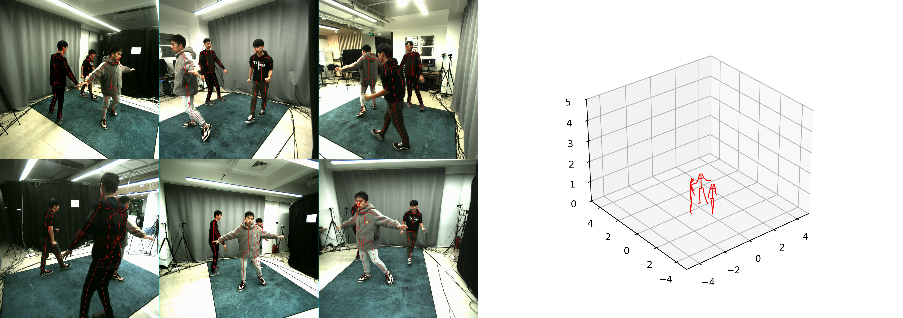

# BottomUpHPE
a bottom-up human pose estimator

#### How to run python code
this repository is a python implementation of [4D Association](https://github.com/zhangyux15/4d_association)



The data directory tree should look like this:

```
${ROOT}
|-- data
    |-- seq_1
    |   |-- calibrations.json
    |   |-- skel.txt
    |   |-- detection
    |	|	|-- 18181923.txt
    |	|	|-- ...
    |	|	|-- 18307870.txt
    |   |-- video
    |	|	|-- 18181923.avi
    |	|	|-- ...
    |	|	|-- 18307870.avi
    |-- seq_2
    |   |-- calibrations.json
    |   |-- skel.txt
    |   |-- detection
    |	|	|-- 18181923.txt
    |	|	|-- ...
    |	|	|-- 18307870.txt
    |   |-- video
    |	|	|-- 18181923.avi
    |	|	|-- ...
    |	|	|-- 18307870.avi
```

prepare openpose model weight
1. download weight from [google drive](https://drive.google.com/file/d/1ghXakEXhBMCdV78K6tCFTPp_vjJDWmcE/view?usp=drive_link)
2. place this file into ./openpose/weigth/

demo:

```
python main.py
```

#### How to build on Linux (Ubuntu 20.04 x64) with CMake
1. Download data and unzip
```
downdata from https://drive.google.com/file/d/1030gxqnxX6Is3hUFxFrdPwt7C6y5hek4/view?usp=drive_link
place it in 4da-linux-c++-cmake
unzip this zip file
rename the directory to data 
```
2. Install dependent components.
```
sudo apt-get install git gitg vim
sudo apt-get install cmake*
sudo apt-get install libopencv-*
sudo apt-get install libjsoncpp-dev 
sudo apt-get install libeigen3-dev 
```
3. Compile the code.
```
cd 4da-linux-c++-cmake
cmake -B build
cmake --build build
./build/four_d_association/mocap
./build/four_d_association/evaluate_shelf
```

### Citation

```
Yuxiang Zhang, Liang An, Tao Yu, xiu Li, Kun Li, Yebin Liu. "4D Association Graph for Realtime Multi-person Motion Capture Using Multiple Video Cameras". arXiv 2020

@InProceedings{20204DAssociation,
  author = {Zhang, Yuxiang and An, Liang and Yu, Tao and Li, xiu and Li, Kun and Liu, Yebin},
  title = {4D Association Graph for Realtime Multi-person Motion Capture Using Multiple Video Cameras},
  booktitle = {IEEE International Conference on Computer Vision and Pattern Recognition, (CVPR)},
  year={2020},
}
```
